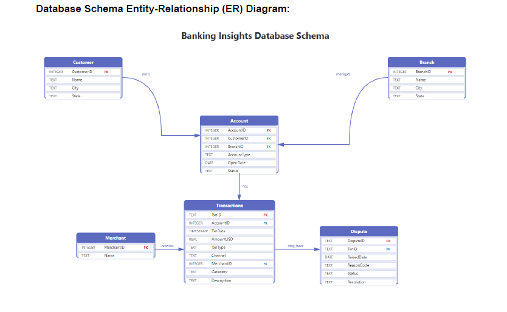
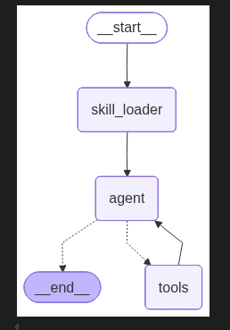

# Banking Database Insights — Text2SQL Agentic AI System

> An autonomous AI agent that converts natural language business questions into validated SQL queries and returns actionable insights from a real banking database — built with LangGraph, LangChain, and GPT-4.1-mini.

---

## 📌 Overview

Traditional database interfaces create a bottleneck: only engineers with SQL expertise can query data. This project eliminates that bottleneck by building a **production-ready Text2SQL agent** that autonomously:

- 🔍 **Discovers** database schemas dynamically — no hardcoded table names
- 🧠 **Reasons** about which tables and JOINs are needed
- ✅ **Validates** SQL before execution to prevent errors
- 🔄 **Self-corrects** through multiple ReAct reasoning loops
- 💬 **Translates** raw SQL results into plain English business answers

---

## 🏗️ Architecture

The agent is implemented as a **multi-node LangGraph StateGraph** following the ReAct (Reasoning + Acting) framework:

```
User Query
    │
    ▼
┌─────────────────────────────────┐
│   Node 1: DB Skill Loader       │  ← Injects schema & business rules
│   (Runs once at startup)        │    from SKILL.md into agent state
└────────────────┬────────────────┘
                 │
                 ▼
┌─────────────────────────────────┐
│   Node 2: Agent (GPT-4.1-mini)  │  ← Reasoning engine
│   ReAct Loop:                   │    Decides which tools to call
│     Think → Act → Observe       │
└────────────┬────────────────────┘
             │  tool_calls?
      ┌──────┴──────┐
      │ YES         │ NO
      ▼             ▼
┌──────────┐      END
│ Node 3:  │   (Final answer
│  Tools   │    ready)
│  Node    │
└────┬─────┘
     │ (always loops back)
     └──────────────────────────────→ Node 2
```

### Graph Nodes

| Node | Role | Description |
|------|------|-------------|
| `skill_loader` | Setup | Reads `SKILL.md` and injects full schema + business rules into `state["database_schema"]` |
| `agent` | Reasoning | GPT-4.1-mini with all 4 SQL tools bound; decides what to query, generates SQL, synthesizes answers |
| `tools` | Execution | Runs tool calls from the agent; returns results as `ToolMessage` objects back to the agent |

### State Schema

```python
class State(TypedDict):
    messages: Annotated[list, add_messages]  # Full conversation + tool history
    database_schema: str                     # Loaded SKILL.md content
```

---

## 🛠️ SQL Tools (4 Tools)

The agent has access to 4 LangChain Community SQL tools that form its "hands":

| Tool | Purpose | When Used |
|------|---------|-----------|
| `sql_db_list_tables` | Lists all tables in the DB | Step 1 — Discovery |
| `sql_db_schema` | Returns DDL + 3 sample rows for specified tables | Step 2 — Inspection |
| `sql_db_query_checker` | Validates SQL syntax and logic | Step 3 — Validation |
| `sql_db_query` | Executes validated SQL and returns results | Step 4 — Execution |

---

## 🗄️ Database Schema



A pre-populated **SQLite** database (`banking_insights.db`) with 6 interconnected tables:

```
Customer ──owns──▶ Account ◀──services── Branch
                      │
                     has
                      │
                      ▼
                 Transactions ◀──appears── Merchant
                      │
                  may_have
                      │
                      ▼
                   Dispute
```

| Table | Key Columns |
|-------|------------|
| **Customer** | CustomerID, Name, City, State |
| **Branch** | BranchID, Name, City, State |
| **Account** | AccountID, CustomerID, BranchID, AccountType, OpenDate, Status |
| **Merchant** | MerchantID, Name |
| **Transactions** | TxnID, AccountID, TxnDate, AmountUSD, TxnType, Channel, MerchantID, Category |
| **Dispute** | DisputeID, TxnID, RaisedDate, ReasonCode, Status, Resolution |

---

## visuaize graph



## 🔄 Agent Workflow (6-Step ReAct Loop)

For every query, the agent follows this enforced workflow:

```
1. DISCOVERY   → sql_db_list_tables    → "What tables exist?"
2. INSPECTION  → sql_db_schema         → "What are the columns & types?"
3. GENERATION  → LLM reasoning         → "Build SQL using verified schema"
4. VALIDATION  → sql_db_query_checker  → "Is this query safe and correct?"
5. EXECUTION   → sql_db_query          → "Run it and get real data"
6. PRESENTATION → LLM synthesis        → "Explain results in plain English"
```

**Example trace for** *"Which branch has the highest number of customers?"*:

```
Agent → sql_db_list_tables
  └─ Returns: Customer, Branch, Account, Merchant, Transactions, Dispute

Agent → sql_db_schema("Customer, Branch, Account")
  └─ Returns: Column definitions, data types, sample rows

Agent → sql_db_query_checker("SELECT b.Name, COUNT(...) ... JOIN ... GROUP BY ... ORDER BY ...")
  └─ Returns: Query validated ✓

Agent → sql_db_query(validated_sql)
  └─ Returns: [("New York Wall Street", 8)]

Agent → Final Answer:
  "The branch with the highest number of customers is New York Wall Street, with 8 customers."
```

---

## 🧠 Skill-Based Context Injection

The `SKILL.md` file provides domain knowledge injected into every agent call — without hardcoding anything into the agent code:

- Complete schema for all 6 tables
- Foreign key relationships for correct JOINs
- Valid categorical values (e.g., `AccountType`: Checking, Savings, Business Checking)
- Business rules (e.g., balance = SUM of Credits − SUM of Debits)
- Common query patterns and examples

| Without Skills ❌ | With Skills ✅ |
|------------------|--------------|
| Guesses account types | Knows exact values: Checking, Savings, Business Checking |
| Missing JOIN conditions | Understands Account → Customer via CustomerID |
| Ignores business rules | Applies banking-specific logic when generating SQL |

---

## 🧪 Test Queries & Results

The agent was tested with 5 queries covering diverse complexity levels:

### Query 1 — Simple Aggregation
> *"Give me total active accounts by account type"*

```
✅ Result: 14 Checking | 6 Savings | 1 Business Checking (active accounts)
```

### Query 2 — Category Analysis
> *"List the top 3 spending categories by total transaction value"*

```
✅ Multi-step aggregation with ORDER BY and LIMIT
```

### Query 3 — Multi-Table JOIN
> *"Which branch has the highest number of customers?"*

```
✅ Result: New York Wall Street — 8 customers
   (JOIN across Customer + Account + Branch with GROUP BY + ORDER BY)
```

### Query 4 — Complex Balance Computation
> *"Current balance for the top 5 accounts (all time). Show ids and names along with the amount."*

```
✅ Computed balance via SUM(Credits) - SUM(Debits) across Transactions,
   JOINed with Customer for names
```

### Query 5 — Time-Filtered Ranking
> *"Top 3 customers who spent the most on dining in 2025"*

```
✅ Result:
   1. Liam Murphy       (ID: 15) — $381.53
   2. Emily Rodriguez   (ID: 3)  — $304.81
   3. Christopher Lee   (ID: 10) — $200.71
```

---

## ⚖️ LLM-as-a-Judge Evaluation

Traditional evaluation (exact string match) is too brittle for LLM outputs. This project implements **LLM-as-a-Judge** using a secondary GPT-4.1-mini instance to evaluate semantic correctness.

### Evaluation Criteria

| PASS ✅ | FAIL ❌ |
|---------|---------|
| All factual values match reference | Missing required data |
| Core entities and numbers correct | Wrong names, numbers, or relationships |
| Minor formatting differences OK | Wrong ranking order for "top N" |
| Extra context or rephrasing OK | Hallucinated information |

### Evaluation Results — 3/3 PASS ✅

| # | Query | Verdict |
|---|-------|---------|
| 1 | Which branch has the highest number of customers? | **PASS** |
| 2 | Top 3 customers who spent the most on dining in 2025 | **PASS** |
| 3 | What are the top 3 merchants by number of disputes? | **PASS** |

**Sample Judge Output (Test Case 1):**
```
Verdict: PASS
Explanation: The agent correctly identifies "New York Wall Street" as the branch
with the highest number of customers (8). Minor formatting differences (use of
quotes, phrasing variations) do not affect factual correctness. Response is
complete and directly answers the query.
```

---

## 🔒 Safety Guardrails

The agent system prompt enforces strict safety rules:

- **Read-only**: Blocks `INSERT`, `UPDATE`, `DELETE`, `DROP` statements
- **No sample data reliance**: Always executes fresh queries for complete results
- **Validate before execute**: Query checker runs before every `sql_db_query` call
- **No SQL shown to users**: Returns business answers, not technical SQL
- **Explicit columns**: Avoids `SELECT *` for predictable, controlled output

---

## 🧰 Tech Stack

| Component | Technology |
|-----------|-----------|
| LLM | GPT-4.1-mini (`temperature=0`) |
| Agent Framework | LangGraph `StateGraph` |
| LLM Orchestration | LangChain |
| SQL Tools | `langchain-community` SQL tools |
| Database | SQLite (`banking_insights.db`) |
| Skill System | Markdown-based `SKILL.md` |
| Evaluation | LLM-as-a-Judge (GPT-4.1-mini) |
| Environment | Python 3.9+, Google Colab |

---

## 📁 Project Structure

```
mini-project-3/
├── Mini_Project_3_AbhiyaGupta.ipynb   # Main notebook (all implementation)
├── banking_insights.db                 # SQLite banking database
└── banking-insights-db/
    └── SKILL.md                        # Domain knowledge file (schema + rules)
```

---

## 🚀 Key Takeaways

This project demonstrates several production-relevant AI engineering skills:

- **Agentic architecture design** — Multi-node LangGraph state machines with conditional routing
- **ReAct reasoning loops** — Autonomous iterative tool use without human intervention
- **Schema discovery** — Agents that explore unknown databases without hardcoded knowledge
- **Skill-based prompting** — Separating domain knowledge from agent logic for maintainability
- **LLM evaluation** — Moving beyond brittle string matching to semantic judgment
- **SQL safety** — Query validation layers that prevent hallucinated or destructive queries

---

*Built as part of the AI Accelerator Program — Building & Evaluating Agentic AI Systems*
